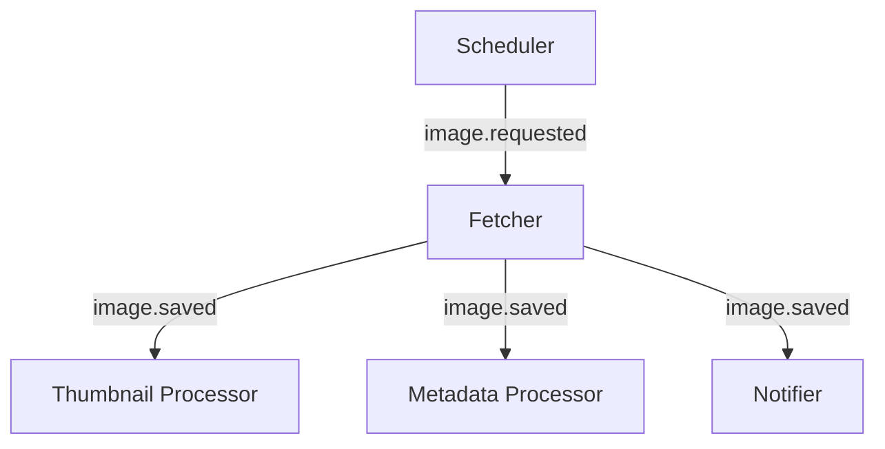

# Architecture

Imgurdex is a small collection of services that work together to do one rather simple thing: keep looking for images and do something useful when it finds one.

There isn't a giant application sitting in the middle making every decision. Instead, the work is split into smaller pieces, each with its own job and its own little corner of the system.

An image starts as a request.

If something is found, it gets stored.

Then the rest of the system reacts to that discovery.

The diagram is intentionally simple. The interesting part is what happens **between** these boxes.

## What does "microservices" mean here?

In Imgurdex, a service is a small program with a focused responsibility.

The Scheduler doesn't fetch images. The Fetcher doesn't generate thumbnails. The Metadata Processor doesn't send emails. Nobody needs to become the manager of everybody else.

They communicate through a small number of events and shared infrastructure, which means a service can mostly care about **its own job** and the information it needs to do it.

That's the useful part of the microservice approach here. Not scale. Not Kubernetes. Not seventeen clusters named after Greek gods.

Just separation of responsibilities.

## Why split something this small into services?

Honestly?

Because it was interesting.

Imgurdex could absolutely be written as one application. For a project this size, that would probably be simpler.

But splitting it apart makes the boundaries visible. That makes Imgurdex a useful little playground for experimenting with event-driven systems, independent services, storage boundaries, and all the other machinery that tends to become considerably less fun when you're being paid to maintain it.

Here, we're allowed to have fun.

## Why does every service use a different language?

Because apparently choosing **one** language would have been too easy.

The services are intentionally polyglot:

| Service             | Language |
| ------------------- | -------- |
| Scheduler           | Go       |
| Fetcher             | Rust     |
| Thumbnail Processor | Python   |
| Metadata Processor  | Dart     |
| Notifier            | Kotlin   |

There isn't a technical requirement for this.

The Scheduler could have been Rust. The Fetcher could have been Go. The Metadata Processor could have been Python. The entire thing could have been written in one language and nobody would have been harmed.

The real reason is considerably less sophisticated: **this was a chance to practice.**

Each service is small enough to be an excuse to learn a language or ecosystem without having to build an entire operating system in it.

The architecture actually makes that experiment fairly painless. As long as a service speaks the expected events and interacts with the shared infrastructure correctly, the rest of Imgurdex doesn't particularly care what language produced it.

That's a nice property to discover by accident.

## What holds everything together?

There are a few pieces that aren't image-processing services themselves, but provide the machinery they need.

- RabbitMQ carries events between services.
- MinIO stores the actual image objects and thumbnails.
- PostgreSQL stores metadata about the images.
- Docker Compose ties the whole local environment together so the system can be started as one stack.

And then there's the observability stack, because eventually something will break and we'll want to know why.

The architecture pages below go into each of these pieces in more detail.

## Where should I go next?

If you want to understand how information moves through Imgurdex, start with **Events**.

If you want to meet the individual workers, go to **Services**.

If you're interested in the infrastructure that keeps the workers fed and talking, see **Containers**.

And if something has gone sideways and you're trying to figure out what happened, **Logging** is probably your new best friend.

The machine is small.

The number of things it can accidentally do is not.
