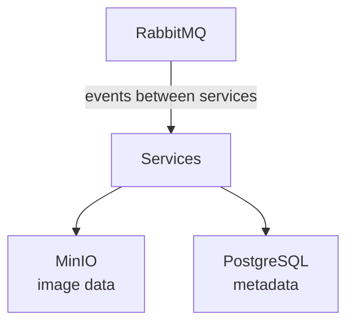

# Containers

Imgurdex runs on Docker Compose, which means the whole little machine can be brought to life without assembling its infrastructure by hand.

The application services come and go as they please, but three containers are particularly important: **MinIO**, **PostgreSQL**, and **RabbitMQ**.

They don't do the interesting discovery work themselves. They provide the places where the rest of the system can put things, write things down, and leave messages for one another.

Think of them as the workshop.

The workers are elsewhere.

## What containers does Imgurdex actually need?

There are three infrastructure containers that matter to the core system:

* **MinIO** stores the images and thumbnails.
* **PostgreSQL** stores image metadata.
* **RabbitMQ** carries events between services.

All three live on the same Docker network, allowing the application services to reach them by their container names rather than needing to know anything about the host machine's network configuration.

Inside the Compose environment, the services can simply ask for `minio`, `postgres`, or `rabbitmq`.

Docker handles the introductions.

### Where do the images live?

MinIO provides the object storage for Imgurdex.

The container exposes its S3-compatible API on port `9000` and its management console on port `9001`.

The system uses MinIO for both the original images and generated thumbnails, keeping those objects separate while still giving all the processors a common place to retrieve them.

MinIO is effectively the cupboard.

The images are the stuff in the cupboard.

Please don't lose the cupboard.

### Where does the metadata live?

PostgreSQL holds the structured information about the images Imgurdex has found.

The database is exposed on port `5432` by default.

The Metadata Processor writes things such as image dimensions, size, MIME type, and hash there.

This keeps the database focused on structured information rather than making it responsible for storing the actual image bytes.

PostgreSQL keeps the records.

MinIO keeps the pixels.

Everybody knows their job.

### Where do the events live?

RabbitMQ is the message broker connecting the application services.

It exposes AMQP on port `5672` and provides its management interface on port `15672`.

Its configuration and event definitions are mounted into the container from the project's `assets/rabbitmq` directory.

That configuration defines the exchange, queues, and bindings used by Imgurdex's event system.

RabbitMQ is therefore less of a storage cupboard and more of a very organized post office.

Messages arrive.

The right queues get copies.

Nobody has to chase the Scheduler down the hallway.

## Why are these containers persistent?

Because losing the containers should not mean losing the archive.

The three infrastructure services use Docker volumes:

```text id="0w2g2k"
minio_data
postgres_data
rabbitmq_data
```

Those volumes live independently of the containers themselves.

The containers can be stopped, recreated, or updated while their persistent data remains available.

That's particularly important for MinIO and PostgreSQL: the whole point of Imgurdex is that it gradually builds a record of what it finds. It would be rather embarrassing if restarting Docker caused the archive to develop a sudden and very complete case of amnesia.

## How do the containers fit together?

The relationship is pleasantly simple:



The application services use RabbitMQ to communicate events, MinIO to exchange image data, and PostgreSQL to persist metadata.

The infrastructure containers don't need to understand the application's bigger purpose.

RabbitMQ doesn't care that the message is about an Imgur image.

MinIO doesn't care whether the object is interesting.

PostgreSQL doesn't care how the image was discovered.

They provide the boring parts.

And in infrastructure, boring is a compliment.
