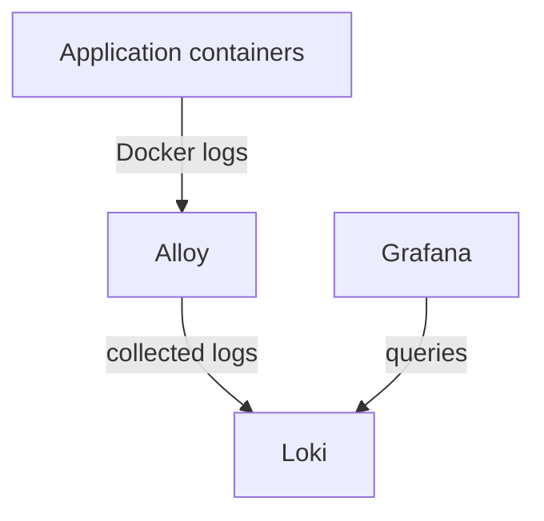

# Logging

Imgurdex is a small system, but small systems have a nasty habit of becoming surprisingly difficult to understand once several things start happening at once.

An image gets requested. Maybe it exists. Maybe it doesn't. Something gets saved. Three services wake up. One of them fails. Another one is still happily processing yesterday's image.

Eventually, you want to know what actually happened.

That's where observability comes in.

Imgurdex collects its service logs with **Grafana Alloy**, stores them in **Loki**, and provides a place to search and inspect them through **Grafana**.

It is, essentially, a way to ask the machine:

*"Okay, what the hell were you doing?"*

## What does observability give me?

The current observability setup is focused on logs.

The services write structured log messages, those logs are collected from the Docker environment, and they are sent to Loki. Grafana then provides the interface for searching and exploring them.

This gives you a way to follow what the services are doing without having to attach yourself to every container individually and stare at its stdout like some kind of terminal archaeologist.

You can inspect events such as an image being received, an image being downloaded, metadata being parsed, or a thumbnail failing to generate, all from the same place.

### How do the logs get from the containers to Grafana?

There are three pieces involved:

**Alloy** discovers and collects the container logs.

**Loki** stores them.

**Grafana** lets you search and inspect them.

Each piece has a fairly narrow responsibility, which is probably for the best. The last thing anyone needs is another giant service whose only job is to know everything about everything.

### Why use Loki instead of just reading Docker logs?

Because once there are several services, reading them individually gets old very quickly.

Docker already gives you logs, but the useful question is rarely "what did this one container print?"

It's more likely to be:

> "What happened to image `abc1234`?"

Centralizing the logs makes that kind of investigation possible. You can search across the services and see the different parts of the same image's journey.

The Scheduler may have requested it.

The Fetcher may have saved it.

The Thumbnail Processor may have processed it.

The Metadata Processor may have recorded it.

The Notifier may have emailed it.

The logs let you reconstruct the story afterward.

Which is especially useful when the story ends with *"...and then apparently nothing happened."*

### What does Alloy do?

Alloy is the collector sitting between Docker and Loki.

It has access to the Docker socket in read-only mode and collects the logs produced by the containers. Those logs are then forwarded to Loki.

Alloy itself doesn't need to understand Imgurdex's business logic. It doesn't care whether a message is about an image, a thumbnail, or somebody having a spectacularly bad day.

It just collects the evidence.

### Where does Loki keep the logs?

Loki stores its data on the `loki_data` Docker volume.

The current setup uses filesystem storage, with Loki's chunks and indexes kept under its `/loki` directory.

Log retention is configured for **168 hours**, or seven days.

That's long enough to investigate recent behavior without turning Imgurdex into an accidental historical archive of every log line it has ever produced.

The images are supposed to be archived.

The logs are not.

### Where does Grafana fit in?

Grafana is the human-facing part of the setup.

It connects to Loki as a provisioned data source, so the logging backend is available without having to configure it manually every time the stack comes up.

Grafana itself has persistent storage through the `grafana_data` volume, and its web interface is exposed on port `3000` by default.

Open Grafana, query Loki, and start digging.

Hopefully you find what you're looking for.

If not, congratulations: you've discovered why observability exists.

## What does a typical investigation look like?

Suppose an image was requested and you expected a thumbnail to appear, but it didn't.

Instead of immediately blaming the Thumbnail Processor (which would be rude), you can follow the image through the logs.

Start with its image ID.

Look for the request.

Then check whether the Fetcher saved it.

If it did, look for the Thumbnail Processor receiving the `image.saved` event and processing the image.

If processing failed, the logs should give you somewhere to start.

That makes the logs more than a pile of debugging output. They become a rough narrative of what happened inside the system.

And for a distributed system, having a narrative is considerably nicer than having six terminals open and a growing sense of dread.
