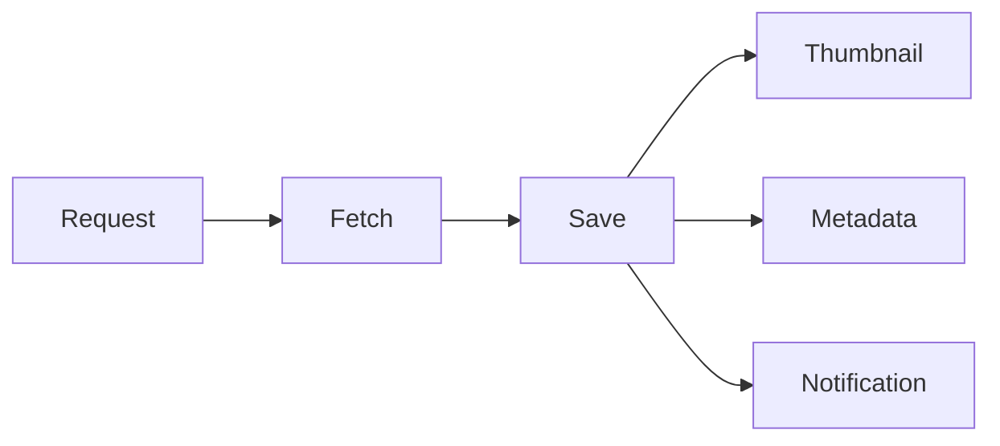

# Overview

## What happens when Imgurdex finds an image?

At a high level, Imgurdex is a small pipeline that takes a request, looks for an image, and, if it finds one, lets several independent processes do something with it.

The important part is that no single service is responsible for the whole journey. The system is split into small pieces that communicate through events and storage.

You could draw the whole thing as a straight line:

But, technically speaking, it isn't really a line.

Once an image is saved, the work branches out.

That distinction is the heart of Imgurdex.

## Where does a request come from?

The Scheduler periodically creates an image request containing a randomly generated seven-character ID.

The Scheduler doesn't fetch anything itself. It simply says, in effect:

> **“Someone should go look for this.”**

The Fetcher receives the request and performs the actual lookup.

If there is no image, the story ends there.

If there is one, the Fetcher downloads it and stores the original image in MinIO.

At this point, the Fetcher is done.

It doesn't need to know what happens next.

## What happens after an image is saved?

This is where the system branches.

Three different services consume it independently:

* The **thumbnail processor** creates a lightweight version of the image.
* The **metadata processor** extracts information about the image and stores it in PostgreSQL.
* The **notifier** sends an email about the newly saved image.

They all receive the same event, but they have completely different jobs.

There is no giant `processImage()` function containing three hundred lines of business logic and a comment saying *“please don't touch this.”*

Each service does its own thing.

## Why send an event instead of calling the services directly?

Because the Fetcher shouldn't need to know who is interested in an image.

Today there are three consumers.

Tomorrow there could be four.

Or two.

Or someone could decide that every new image should also be analyzed for its dominant color, uploaded somewhere else, or used to train a very questionable classifier.

The Fetcher doesn't need to change for any of that.

The interested services take it from there.

This is the basic event-driven idea behind Imgurdex: **services announce what happened rather than telling other services what to do.**

## Where is the image data?

RabbitMQ carries events, not image files.

The actual image lives in MinIO.

This keeps messages small and means the services don't have to pass large binary payloads through the message broker.

An event can simply identify an image, while the service that needs the image retrieves it from object storage.

The message tells you **which image**.

MinIO contains **the image**.

PostgreSQL contains **what Imgurdex learned about it**.

Keeping those things separate makes the system considerably easier to reason about.

## What happens if one service fails?

The services are independent, so an error in one processing path doesn't inherently mean the others have to stop.

For example, if thumbnail generation fails, that doesn't mean the metadata processor suddenly forgot how to talk to PostgreSQL.

Each consumer handles its own work and its own failures.

This matters because real systems are much more interested in failure than happy-path diagrams would have you believe.

Networks disappear. Containers restart. Credentials are wrong. SMTP decides it has other plans. Someone trips over the power cable.

Imgurdex is designed so these failures are contained within the relevant parts of the system rather than turning every problem into everybody's problem.
