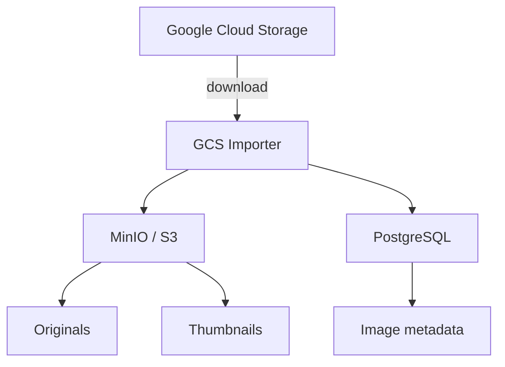
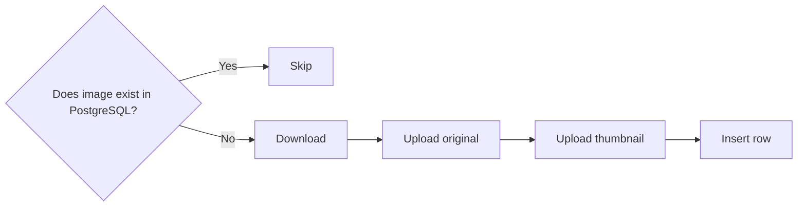

# Google Cloud Storage Importer

* [Overview](#overview)
* [Usage](#usage)
    + [Setup](#setup)
        - [Google Cloud credentials](#google-cloud-credentials)
        - [GCS](#gcs)
        - [MinIO](#minio)
        - [PostgreSQL](#postgresql)
    + [Running with Poetry](#running-with-poetry)
    + [Running with Docker](#running-with-docker)
    + [Output format](#output-format)
* [Implementation](#implementation)
    + [Image IDs](#image-ids)
    + [Thumbnail generation](#thumbnail-generation)
    + [A note about retries](#a-note-about-retries)
* [TL;DR](#tldr)
    + [With Poetry](#with-poetry)
    + [With Docker](#with-docker)

You have a pile of images sitting in a Google Cloud Storage bucket.

You would like those images to exist in **Imgurdex** instead.

Because apparently storing the same image in one place was not enough.

This little migrator takes images from **Google Cloud Storage (GCS)**, checks them, creates thumbnails, puts the originals and thumbnails into **S3-compatible storage (MinIO)**, and records the relevant metadata in **PostgreSQL**.

In other words:




It is deliberately boring. Boring migration scripts are good migration scripts. Nobody wants their importer developing a personality halfway through a 40,000-image migration.

## Overview

For every object in the configured GCS bucket, the importer:

1. Uses the filename stem as the image ID.
2. Validates that the ID is exactly **7 alphanumeric characters**.
3. Checks PostgreSQL to see whether that image has already been imported.
4. Downloads the image from GCS.
5. Reads its dimensions and MIME type.
6. Calculates a SHA-256 hash of the original bytes.
7. Uploads the original image to the `images` S3 bucket.
8. Generates a 256×256 JPEG thumbnail and uploads it to `thumbnails`.
9. Inserts the image metadata into PostgreSQL.
10. Moves on to the next image, with the emotional resilience of a machine.

Already-imported images are skipped, so running the importer again is safe for the normal migration case.

## Usage

You can run it directly with Python and/or Poetry.

Or you can use Docker and let the container do the heavy lifting, because sometimes the easiest way to install Python is to simply refuse to install Python.


### Setup

Start by copying the example environment file:

```bash
cp .env.example .env
```

Then fill in the values.

#### Google Cloud credentials

`GOOGLE_APPLICATION_CREDENTIALS` tells the Google Cloud SDK which service-account credentials it should use when connecting to GCS.

In other words, Google needs to know **who the hell you are** before it lets you rummage around in the bucket.

If you have a [service-account JSON file](https://docs.cloud.google.com/iam/docs/keys-create-delete#creating) (say, *.credentials.json*), put it in the project directory and set:

```dotenv
GOOGLE_APPLICATION_CREDENTIALS=./.credentials.json
```

Make sure that the service account has permission to read the objects in the GCS bucket.

**Do not commit the credentials file to Git.** It is a credential, not a collectible.

#### GCS

```dotenv
GCS_BUCKET_NAME=my-image-bucket
```

This is the source bucket.

The importer lists the objects in this bucket and treats them as the images that need to be migrated into Imgurdex.

#### MinIO

```dotenv
MINIO_HOST=localhost
MINIO_PORT=9000
MINIO_USERNAME=your-username
MINIO_PASSWORD=your-password
```

MinIO is the S3-compatible destination for the actual image files.

The importer expects these S3 buckets to exist:

```text
images
thumbnails
```

Original images go into `images`.

Generated JPEG thumbnails go into `thumbnails`.

#### PostgreSQL

```dotenv
POSTGRES_HOST=localhost
POSTGRES_PORT=5432
POSTGRES_USERNAME=postgres
POSTGRES_PASSWORD=your-password
POSTGRES_DATABASE=imgurdex
```

PostgreSQL stores the metadata for each imported image.

The importer expects an `images` table with the columns used by the `INSERT` statement in the application.

### Running with Poetry

Install the dependencies:

```bash
poetry install
```

Then run the importer:

```bash
poetry run python -m src.gcs_import
```

You should see output along these lines:

```text
[abc1234] Processing...
[abc1234] Downloading from GCS...
[abc1234] Uploading to S3...
[abc1234] Uploading thumbnail to S3...
[abc1234] Inserting database row...
[abc1234] Done
```

If an image has already been imported:

```text
[abc1234] Processing...
[abc1234] Skipping, already exists
```

If the filename doesn't contain a valid 7-character image ID:

```text
[wat] Processing...
[wat] Skipping, invalid ID
```

A tiny amount of judgment. As a treat.


### Running with Docker

If you don't have Poetry or Python installed, Docker can carry the whole thing on its back.

Build the image:

```bash
docker build -t gcs-migrator .
```

Then run it:

```bash
docker run --rm \
  --add-host=host.docker.internal:host-gateway \
  --env-file .env \
  -v "./.credentials.json:/app/.credentials.json:ro" \
  gcs-migrator
```

The credentials file is mounted read-only into the container, which is exactly what we want: the importer can read the keys, but it doesn't get to redecorate them.

For this setup, note the command below mounts the credentials file into the container at */app/.credentials.json*,
so your `.env` should contain:

```dotenv
GOOGLE_APPLICATION_CREDENTIALS=/app/.credentials.json
```


> **Why `host.docker.internal`?**
> 
> If MinIO or PostgreSQL are running on your host machine rather than inside Docker, the container needs a way to reach them.
> 
> That's what `--add-host` is doing.
> 
> In that setup, your `.env` can use:
> 
> ```dotenv
> MINIO_HOST=host.docker.internal
> POSTGRES_HOST=host.docker.internal
> ```
> 
> If those services are somewhere else entirely, use their actual hostname or IP instead.

### Output format

After a successful import, MinIO contains:

```text
images/
└── abc1234

thumbnails/
└── abc1234
```

PostgreSQL contains the corresponding metadata:

```text
id
width
height
size
mime_type
hash
created_at
```

The `hash` is a SHA-256 hash of the **original GCS object bytes**, not the generated thumbnail.

## Implementation

### Image IDs

The importer derives the image ID from the object's filename:

```python
pathlib.Path(blob.name).stem
```

The ID must match:

```text
[A-Za-z0-9]{7}
```

So these are valid:

```text
abc1234.jpg
X7k92Qa.png
1234567.webp
```

These are not:

```text
abc123.jpg       # only 6 characters
abc12345.jpg     # 8 characters
abc-1234.jpg     # contains "-"
my-image.jpg     # contains "-"
```

The extension itself doesn't matter. The **filename stem** does.


### Thumbnail generation

The importer creates thumbnails using Pillow.

Images are:

* EXIF-orientation corrected
* resized to fit within `256 × 256`
* converted to RGB when necessary
* saved as JPEG
* compressed at quality `85`
* optimized before upload

The original image is left untouched. The thumbnail is the scrappy little JPEG sidekick.

### A note about retries

The database check happens before the image is downloaded and uploaded:



This means a normal successful run can be repeated without importing the same image twice.

However, if something fails **after an S3 upload but before the PostgreSQL insert**, you may have an object sitting in MinIO without a corresponding database row. The next run will attempt the migration again.

The script is a migration utility, not a distributed transaction coordinator wearing a tiny hat.

If you need crash-safe, resumable, transactional behavior across GCS, MinIO, and PostgreSQL, that's a larger problem and deserves a larger solution.


## TL;DR

### With Poetry

```bash
cp .env.example .env
# fill in .env and configure GOOGLE_APPLICATION_CREDENTIALS

poetry install
poetry run python -m src.gcs_import
```

### With Docker

```bash
cp .env.example .env
# fill in .env

docker build -t gcs-migrator .

docker run --rm \
  --add-host=host.docker.internal:host-gateway \
  --env-file .env \
  -v "./.credentials.json:/app/.credentials.json:ro" \
  gcs-migrator
```

That's it.

GCS is the source. MinIO holds the images. PostgreSQL remembers what happened. Imgurdex gets its pictures.

Everyone goes home slightly less annoyed.
